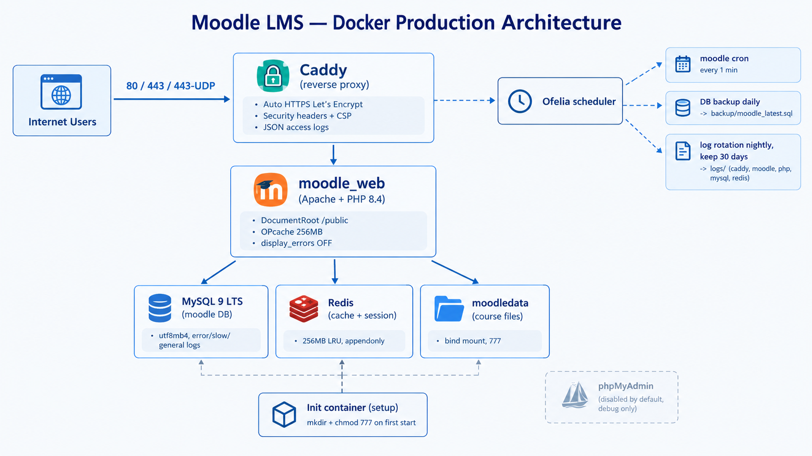

# Moodle LMS — Docker Skeleton (Production)

Khung triển khai Moodle 5.x bằng Docker Compose: Caddy (SSL tự động) +
Apache PHP 8.4 (production) + MySQL 9 LTS + Redis + Ofelia (cron + backup).

Repo này chỉ chứa **khung cấu hình**. Source Moodle, `moodledata`,
backup SQL, log, file `.env` và docs nội bộ không commit
(xem `.gitignore`).

## Sơ đồ hệ thống



## Stack

| Service | Image | Vai trò |
|---|---|---|
| `setup` | `alpine` | Chạy 1 lần: tạo thư mục + chmod 777 bind mounts |
| `caddy` | `caddy:alpine` | Reverse proxy 80/443/udp, SSL Let's Encrypt tự động |
| `db` | `mysql:9` | MySQL 9 LTS, utf8mb4, log error/slow/general |
| `redis` | `redis` | Cache + session, 256MB LRU |
| `moodle` | build `./php` | Apache + PHP 8.4, DocumentRoot `/public` |
| `cron` | `ofelia` | Cron Moodle 1 phút + backup DB daily + xoay log 0h VN |

## Cấu trúc

```text
├── docker-compose.yml
├── Caddyfile
├── .env.example            # copy thành .env rồi sửa password
├── php/Dockerfile + entrypoint.sh
├── scripts/db-backup.sh    # backup thủ công
├── scripts/db-restore.sh   # restore thủ công
├── scripts/log-rotate.sh   # Ofelia gọi mỗi đêm
├── moodle/                 # source Moodle (tự tải, không commit)
├── moodledata/             # dataroot (không commit)
├── backup/                 # sql dump (không commit)
└── logs/caddy,moodle,php,mysql,redis
```

## Chạy nhanh

```bash
cp .env.example .env   # sửa password trước
# Giải nén source Moodle 5.x vào ./moodle (giữ lại config.php nếu có)
docker compose up -d --build
```

Mở `http://localhost`, cài đặt web với: DB host `db`,
DB name/user/pass theo `.env`, data dir `/var/www/moodledata`.
`config.php` dùng `dbtype = 'mysqli'`. MySQL tự tạo `MYSQL_USER`
lúc init volume lần đầu.

Bật Redis: Admin → Site administration → Plugins → Caching →
Add instance (Server `redis`, password theo `.env`) → map
`Application` + `Session`.

## Backup / Restore

```bash
bash scripts/db-backup.sh          # -> backup/moodle_*.sql + moodle_latest.sql
bash scripts/db-restore.sh [file]  # mặc định moodle_latest.sql
```

Ofelia tự dump `moodle_latest.sql` mỗi ngày.

## Logs

Mỗi service ghi log riêng dưới `logs/`, xoay mỗi đêm lúc 0h VN,
giữ 30 ngày (Caddy dạng JSON để parse). General log MySQL tốn
disk — xóa 2 dòng `general` trong `docker-compose.yml` nếu không
cần audit query.

## Lên domain

1. `Caddyfile`: đổi `:80` thành domain
2. `docker compose up -d` (port 443 mở sẵn, cert lưu ở volume)
3. Replace URL cũ sang domain + purge caches (xem Moodle docs
   `admin/tool/replace/cli`), bật `$CFG->sslproxy` nếu sau proxy.

## Quyền

`setup` + `entrypoint.sh` tự mở 777 `moodle/ moodledata/ logs/
backup/` nên user host và `www-data` đều ghi được 2 chiều,
không cần `chown` tay. Thêm default ACL (hiệu lực trên ext4/xfs)
cho file tạo mới lúc runtime.

## Bảo mật VPS (Ubuntu/Debian)

Chạy 1 lần trên VPS **trước khi** deploy. Đảm bảo SSH key đã login
được rồi mới tắt password (kẻo tự khóa mình).

```bash
# 0. Cai Docker (1 lenh) + cho user hien tai dung docker
curl -fsSL https://get.docker.com | sh
sudo usermod -aG docker $USER && newgrp docker
docker compose version   # kiem tra

# 1. Firewall: chi mo SSH/HTTP/HTTPS
sudo apt update && sudo apt install -y ufw fail2ban unattended-upgrades
sudo ufw allow 22/tcp && sudo ufw allow 80,443/tcp
sudo ufw --force enable && sudo ufw status

# 2. SSH chi cho key, cam password + root
sudo sed -i 's/^#\?PasswordAuthentication .*/PasswordAuthentication no/' /etc/ssh/sshd_config
sudo sed -i 's/^#\?PermitRootLogin .*/PermitRootLogin no/' /etc/ssh/sshd_config
sudo systemctl restart ssh

# 3. Chong brute-force SSH + tu va bao mat
sudo systemctl enable --now fail2ban
sudo systemctl enable apt-daily-upgrade.timer  # Ubuntu tu bat san

# 4. Khoa file secrets
chmod 600 .env
```

Định kỳ: `sudo apt update && sudo apt upgrade` + reboot khi lên
kernel mới. Backup `backup/` ra ngoài VPS mỗi đêm (rsync/rclone) —
mất VPS là mất hết nếu chỉ lưu local.

## Cấu hình VPS theo tải

"Concurrent" = user thao tác cùng lúc (không phải chỉ đăng nhập).
Ổ cứng luôn dùng NVMe; dung lượng theo `moodledata` (video khóa học
là phần phình nhanh nhất).

| | ~100 concurrent | ~1000 concurrent |
|---|---|---|
| CPU/RAM | 4 vCPU / 8 GB | 16 vCPU / 64 GB |
| Disk | 100 GB | 500 GB |
| Mô hình | 1 VPS tất cả trong 1 | 1 VPS lớn, hoặc tách Web + DB riêng khi quá tải |

Tinh chỉnh kèm theo (mặc định trong repo để ở mức 100 user):

| Tham số | 100 user | 1000 user | Sửa ở |
|---|---|---|---|
| `innodb_buffer_pool_size` | 2G | 16–24G | thêm vào `command:` của `db` |
| Redis `maxmemory` | 256–512mb | 2gb | `command:` của `redis` |
| `opcache.memory_consumption` | 256 | 512 | `php/Dockerfile` |
| Apache `MaxRequestWorkers` | mặc định | 300–500 | thêm conf Apache riêng |

1000 concurrent trên 1 VPS là ngưỡng cao của Apache prefork +
mod_php. Nếu CPU/RAM chạm trần: tách MySQL sang VPS riêng
(đổi `MOODLE_DB_HOST`), rồi nhân bản container `moodle` sau
load balancer — compose này không cần đổi gì khác.

## License

PolyForm Noncommercial 1.0.0 — xem `LICENSE-EE.md`.
Chỉ dùng cho mục đích phi thương mại.
